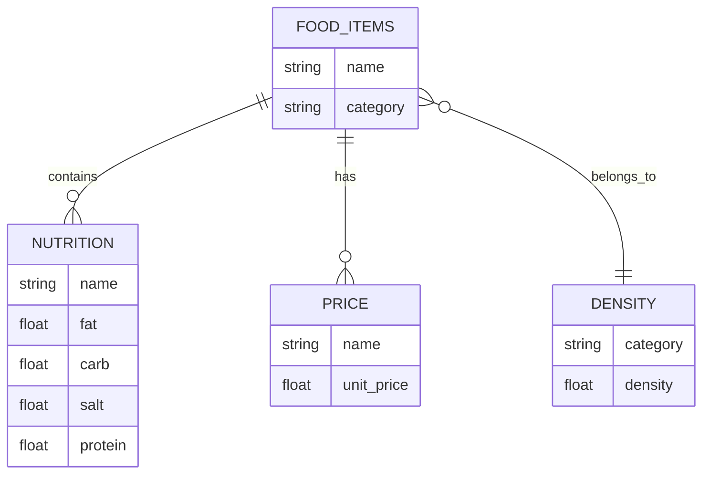

# Food Data Schema

This repository contains data about various food items, including their density, nutritional content, and price. The data is organized into four CSV files: `food_items.csv`, `density.csv`, `nutrition.csv`, and `price.csv`.

## Schema Description

### `food_items.csv`

This file contains the basic information about food items and their categories.

- **name**: The specific name of the food item (e.g., 'Chicken_Breast', 'Apple').
- **category**: The type of food (e.g., 'Meat', 'Fruit').

### `density.csv`

This file contains the density information for different food categories.

- **category**: The type of food (e.g., 'Meat', 'Fruit').
- **density**: The density value of the food category.

### `nutrition.csv`

This file provides nutritional information for various food items, standardized per 100 grams.

- **name**: The specific name of the food item (e.g., 'Chicken_Breast', 'Apple').
- **fat**: The fat content in grams per 100 grams.
- **carb**: The carbohydrate content in grams per 100 grams.
- **salt**: The salt content in grams per 100 grams.
- **protein**: The protein content in grams per 100 grams.

### `price.csv`

This file lists the unit prices for different food items, standardized per 100 grams.

- **name**: The specific name of the food item (e.g., 'Chicken_Breast', 'Apple').
- **unit_price**: The price per 100 grams of the food item.

## Entity-Relationship Diagram

Below is the ERD representing the relationships between the entities in the schema:

In this diagram:

- The `FOOD_ITEMS` entity contains the basic information about food items and their categories.
- The `DENSITY` entity contains the density information for each food category.
- The `NUTRITION` entity contains the nutritional information for each food item, linked to the `FOOD_ITEMS` entity by the `name` field.
- The `PRICE` entity contains the price information for each food item, linked to the `FOOD_ITEMS` entity by the `name` field.

## Foreign Key Relationships

To enforce referential integrity, we can define foreign key relationships in the schema:

- `NUTRITION.name` references `FOOD_ITEMS.name`
- `PRICE.name` references `FOOD_ITEMS.name`
- `FOOD_ITEMS.category` references `DENSITY.category`

This schema allows for a comprehensive view of the food items, including their density, nutritional content, and price, all standardized per 100 grams.
